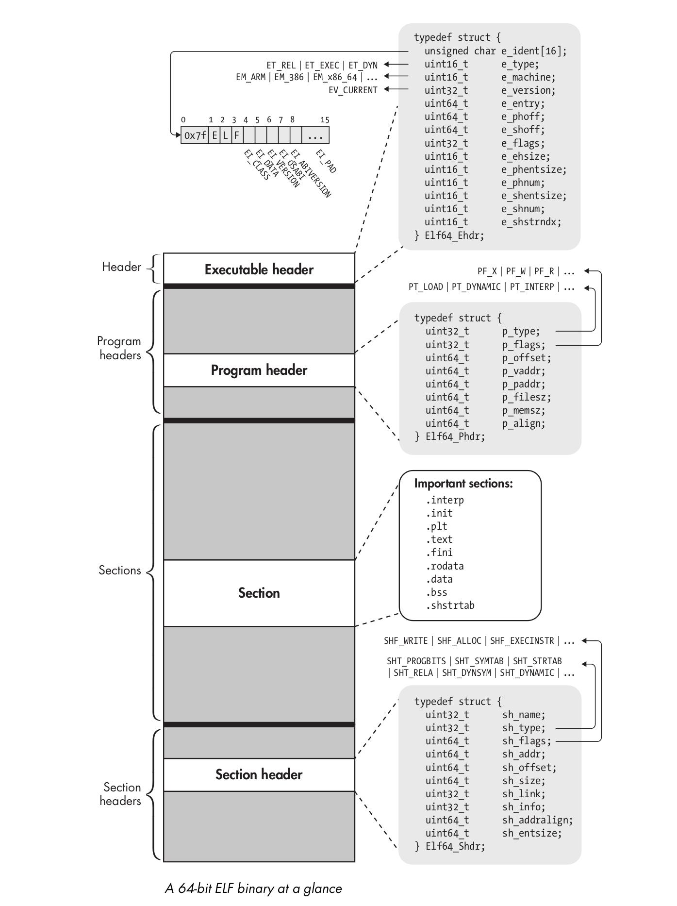

# Executable and Linkable Format (ELF)

Executable and Linkable Format (ELF) is the default binary format on Linux-based systems. It is used for executable files, object files, shared libraries, and core dumps.



## Executable header

Every ELF file starts with an executable header, which is just a structured series of bytes telling you that it’s an ELF file, what kind of ELF file it is, and where in the file to find all the other contents. The executable header is represented in `/usr/include/elf.h` as a C struct called `Elf64_Ehdr`:

```text
#define EI_NIDENT (16)

typedef struct
{
  unsigned char	e_ident[EI_NIDENT];	/* Magic number and other info */
  Elf32_Half	e_type;			/* Object file type */
  Elf32_Half	e_machine;		/* Architecture */
  Elf32_Word	e_version;		/* Object file version */
  Elf32_Addr	e_entry;		/* Entry point virtual address */
  Elf32_Off	e_phoff;		/* Program header table file offset */
  Elf32_Off	e_shoff;		/* Section header table file offset */
  Elf32_Word	e_flags;		/* Processor-specific flags */
  Elf32_Half	e_ehsize;		/* ELF header size in bytes */
  Elf32_Half	e_phentsize;		/* Program header table entry size */
  Elf32_Half	e_phnum;		/* Program header table entry count */
  Elf32_Half	e_shentsize;		/* Section header table entry size */
  Elf32_Half	e_shnum;		/* Section header table entry count */
  Elf32_Half	e_shstrndx;		/* Section header string table index */
} Elf32_Ehdr;
```

### e_ident array

The executable header (and the ELF file) starts with a 16-byte array called `e_ident`. The `e_ident` array always starts with a 4-byte "magic value" identifying the file as an ELF binary. The magic value consists of the hexadecimal number `0x7f`, followed by the ASCII character codes for the letters E, L, and F. Having these bytes right at the start is convenient because it allows tools such as file, as well as specialized tools such as the binary loader, to quickly discover that they’re dealing with an ELF file.

```text
/* Fields in the e_ident array.  The EI_* macros are indices into the
   array.  The macros under each EI_* macro are the values the byte
   may have.  */

#define EI_MAG0		0		/* File identification byte 0 index */
#define ELFMAG0		0x7f		/* Magic number byte 0 */

#define EI_MAG1		1		/* File identification byte 1 index */
#define ELFMAG1		'E'		/* Magic number byte 1 */

#define EI_MAG2		2		/* File identification byte 2 index */
#define ELFMAG2		'L'		/* Magic number byte 2 */

#define EI_MAG3		3		/* File identification byte 3 index */
#define ELFMAG3		'F'		/* Magic number byte 3 */

/* Conglomeration of the identification bytes, for easy testing as a word.  */
#define	ELFMAG		"\177ELF"
#define	SELFMAG		4
```

Following the magic value, there are a number of bytes that give more detailed information about the specifics of the type of ELF file. In `elf.h`, the indexes for these bytes (indexes 4 through 15 in the e_ident array) are symbolically referred to as EI_CLASS, EI_DATA, EI_VERSION, EI_OSABI, EI_ABIVERSION, and EI_PAD, respectively.

```text

#define EI_CLASS	4		/* File class byte index */
#define ELFCLASSNONE	0		/* Invalid class */
#define ELFCLASS32	1		/* 32-bit objects */
#define ELFCLASS64	2		/* 64-bit objects */
#define ELFCLASSNUM	3
```

The `EI_CLASS` byte denotes whether the binary is for a 32-bit or 64-bit architecture. In the former case, the `EI_CLASS` byte is set to the constant `ELFCLASS32` (which is equal to 1), while in the latter case, it’s set to `ELFCLASS64` (equal to 2).

```text
#define EI_DATA		5		/* Data encoding byte index */
#define ELFDATANONE	0		/* Invalid data encoding */
#define ELFDATA2LSB	1		/* 2's complement, little endian */
#define ELFDATA2MSB	2		/* 2's complement, big endian */
#define ELFDATANUM	3
```

The `EI_DATA` byte indicates the ***endianness*** of the binary. A value of `ELFDATA2LSB` (equal to 1) indicates little-endian, while `ELFDATA2MSB` (equal to 2) means big-endian.

```text
#define EI_VERSION	6		/* File version byte index */
					/* Value must be EV_CURRENT */
```

The next byte, called `EI_VERSION`, indicates the version of the ELF specification used when creating the binary. Currently, the only valid value is `EV_CURRENT`, which is defined to be equal to 1.

```text
#define EI_OSABI	7		/* OS ABI identification */
#define ELFOSABI_NONE		0	/* UNIX System V ABI */
#define ELFOSABI_SYSV		0	/* Alias.  */
#define ELFOSABI_HPUX		1	/* HP-UX */
#define ELFOSABI_NETBSD		2	/* NetBSD.  */
#define ELFOSABI_GNU		3	/* Object uses GNU ELF extensions.  */
#define ELFOSABI_LINUX		ELFOSABI_GNU /* Compatibility alias.  */
#define ELFOSABI_SOLARIS	6	/* Sun Solaris.  */
#define ELFOSABI_AIX		7	/* IBM AIX.  */
#define ELFOSABI_IRIX		8	/* SGI Irix.  */
#define ELFOSABI_FREEBSD	9	/* FreeBSD.  */
#define ELFOSABI_TRU64		10	/* Compaq TRU64 UNIX.  */
#define ELFOSABI_MODESTO	11	/* Novell Modesto.  */
#define ELFOSABI_OPENBSD	12	/* OpenBSD.  */
#define ELFOSABI_ARM_AEABI	64	/* ARM EABI */
#define ELFOSABI_ARM		97	/* ARM */
#define ELFOSABI_STANDALONE	255	/* Standalone (embedded) application */
```

If the `EI_OSABI` byte is set to nonzero, it means that some ABI- or OS-specific extensions are used in the ELF file; this can change the meaning of some other fields in the binary or can signal the presence of nonstandard sections. The default value of zero indicates that the binary targets the UNIX System V ABI.

```text
#define EI_ABIVERSION	8		/* ABI version */
```

The `EI_ABIVERSION` byte denotes the specific version of the ABI indicated in the `EI_OSABI` byte that the binary targets. You’ll usually see this set to zero because it’s not necessary to specify any version information when the default EI_OSABI is used.

```text
#define EI_PAD		9		/* Byte index of padding bytes */
```

The `EI_PAD` field actually contains multiple bytes, namely, indexes 9 through 15 in `e_ident`. All of these bytes are currently designated as padding; they are reserved for possible future use but currently set to zero.

To inspect the `e_ident` array of an ELF binary (in this case [the a.out from hello.c](anatomy.md)):

```text
nina@tardis:~/Development/anatomy$ readelf -h a.out
ELF Header:
  Magic:   7f 45 4c 46 02 01 01 00 00 00 00 00 00 00 00 00 
  Class:                             ELF64
  Data:                              2's complement, little endian
  Version:                           1 (current)
  OS/ABI:                            UNIX - System V
  ABI Version:                       0
  Type:                              DYN (Position-Independent Executable file)
  Machine:                           Advanced Micro Devices X86-64
  Version:                           0x1
  Entry point address:               0x1060
  Start of program headers:          64 (bytes into file)
  Start of section headers:          13976 (bytes into file)
  Flags:                             0x0
  Size of this header:               64 (bytes)
  Size of program headers:           56 (bytes)
  Number of program headers:         13
  Size of section headers:           64 (bytes)
  Number of section headers:         31
  Section header string table index: 30
```

### e_type, e_machine, and e_version fields

After the `e_ident` array comes a series of multibyte integer fields.

`e_type` specifies the type of the binary, with values `ET_REL` (relocatable object file), `ET_EXEC` (executable binary), and `ET_DYN` (a dynamic library).

```text
/* Legal values for e_type (object file type).  */

#define ET_NONE		0		/* No file type */
#define ET_REL		1		/* Relocatable file */
#define ET_EXEC		2		/* Executable file */
#define ET_DYN		3		/* Shared object file */
#define ET_CORE		4		/* Core file */
#define	ET_NUM		5		/* Number of defined types */
#define ET_LOOS		0xfe00		/* OS-specific range start */
#define ET_HIOS		0xfeff		/* OS-specific range end */
#define ET_LOPROC	0xff00		/* Processor-specific range start */
#define ET_HIPROC	0xffff		/* Processor-specific range end */
```

`e_machine` denotes the architecture that the binary is intended to run on:

```text
/* Legal values for e_machine (architecture).  */

#define EM_NONE		 0	/* No machine */
#define EM_M32		 1	/* AT&T WE 32100 */
#define EM_SPARC	 2	/* SUN SPARC */
#define EM_386		 3	/* Intel 80386 */
#define EM_68K		 4	/* Motorola m68k family */
#define EM_88K		 5	/* Motorola m88k family */
#define EM_IAMCU	 6	/* Intel MCU */
#define EM_860		 7	/* Intel 80860 */
#define EM_MIPS		 8	/* MIPS R3000 big-endian */
#define EM_S370		 9	/* IBM System/370 */
#define EM_MIPS_RS3_LE	10	/* MIPS R3000 little-endian */
				/* reserved 11-14 */
#define EM_PARISC	15	/* HPPA */
				/* reserved 16 */
#define EM_VPP500	17	/* Fujitsu VPP500 */
#define EM_SPARC32PLUS	18	/* Sun's "v8plus" */
#define EM_960		19	/* Intel 80960 */
#define EM_PPC		20	/* PowerPC */
#define EM_PPC64	21	/* PowerPC 64-bit */
#define EM_S390		22	/* IBM S390 */
#define EM_SPU		23	/* IBM SPU/SPC */
				/* reserved 24-35 */
#define EM_V800		36	/* NEC V800 series */
#define EM_FR20		37	/* Fujitsu FR20 */
#define EM_RH32		38	/* TRW RH-32 */
#define EM_RCE		39	/* Motorola RCE */
#define EM_ARM		40	/* ARM */
#define EM_FAKE_ALPHA	41	/* Digital Alpha */
#define EM_SH		42	/* Hitachi SH */
#define EM_SPARCV9	43	/* SPARC v9 64-bit */
#define EM_TRICORE	44	/* Siemens Tricore */
#define EM_ARC		45	/* Argonaut RISC Core */
#define EM_H8_300	46	/* Hitachi H8/300 */
#define EM_H8_300H	47	/* Hitachi H8/300H */
#define EM_H8S		48	/* Hitachi H8S */
#define EM_H8_500	49	/* Hitachi H8/500 */
#define EM_IA_64	50	/* Intel Merced */
#define EM_MIPS_X	51	/* Stanford MIPS-X */
#define EM_COLDFIRE	52	/* Motorola Coldfire */
#define EM_68HC12	53	/* Motorola M68HC12 */
#define EM_MMA		54	/* Fujitsu MMA Multimedia Accelerator */
#define EM_PCP		55	/* Siemens PCP */
#define EM_NCPU		56	/* Sony nCPU embeeded RISC */
#define EM_NDR1		57	/* Denso NDR1 microprocessor */
#define EM_STARCORE	58	/* Motorola Start*Core processor */
#define EM_ME16		59	/* Toyota ME16 processor */
#define EM_ST100	60	/* STMicroelectronic ST100 processor */
#define EM_TINYJ	61	/* Advanced Logic Corp. Tinyj emb.fam */
#define EM_X86_64	62	/* AMD x86-64 architecture */
#define EM_PDSP		63	/* Sony DSP Processor */
#define EM_PDP10	64	/* Digital PDP-10 */
#define EM_PDP11	65	/* Digital PDP-11 */
#define EM_FX66		66	/* Siemens FX66 microcontroller */
#define EM_ST9PLUS	67	/* STMicroelectronics ST9+ 8/16 mc */
#define EM_ST7		68	/* STmicroelectronics ST7 8 bit mc */
#define EM_68HC16	69	/* Motorola MC68HC16 microcontroller */
#define EM_68HC11	70	/* Motorola MC68HC11 microcontroller */
#define EM_68HC08	71	/* Motorola MC68HC08 microcontroller */
#define EM_68HC05	72	/* Motorola MC68HC05 microcontroller */
#define EM_SVX		73	/* Silicon Graphics SVx */
#define EM_ST19		74	/* STMicroelectronics ST19 8 bit mc */
#define EM_VAX		75	/* Digital VAX */
#define EM_CRIS		76	/* Axis Communications 32-bit emb.proc */
#define EM_JAVELIN	77	/* Infineon Technologies 32-bit emb.proc */
#define EM_FIREPATH	78	/* Element 14 64-bit DSP Processor */
#define EM_ZSP		79	/* LSI Logic 16-bit DSP Processor */
#define EM_MMIX		80	/* Donald Knuth's educational 64-bit proc */
#define EM_HUANY	81	/* Harvard University machine-independent object files */
#define EM_PRISM	82	/* SiTera Prism */
#define EM_AVR		83	/* Atmel AVR 8-bit microcontroller */
#define EM_FR30		84	/* Fujitsu FR30 */
#define EM_D10V		85	/* Mitsubishi D10V */
#define EM_D30V		86	/* Mitsubishi D30V */
#define EM_V850		87	/* NEC v850 */
#define EM_M32R		88	/* Mitsubishi M32R */
#define EM_MN10300	89	/* Matsushita MN10300 */
#define EM_MN10200	90	/* Matsushita MN10200 */
#define EM_PJ		91	/* picoJava */
#define EM_OPENRISC	92	/* OpenRISC 32-bit embedded processor */
#define EM_ARC_COMPACT	93	/* ARC International ARCompact */
#define EM_XTENSA	94	/* Tensilica Xtensa Architecture */
#define EM_VIDEOCORE	95	/* Alphamosaic VideoCore */
#define EM_TMM_GPP	96	/* Thompson Multimedia General Purpose Proc */
#define EM_NS32K	97	/* National Semi. 32000 */
#define EM_TPC		98	/* Tenor Network TPC */
#define EM_SNP1K	99	/* Trebia SNP 1000 */
#define EM_ST200	100	/* STMicroelectronics ST200 */
#define EM_IP2K		101	/* Ubicom IP2xxx */
#define EM_MAX		102	/* MAX processor */
#define EM_CR		103	/* National Semi. CompactRISC */
#define EM_F2MC16	104	/* Fujitsu F2MC16 */
#define EM_MSP430	105	/* Texas Instruments msp430 */
#define EM_BLACKFIN	106	/* Analog Devices Blackfin DSP */
#define EM_SE_C33	107	/* Seiko Epson S1C33 family */
#define EM_SEP		108	/* Sharp embedded microprocessor */
#define EM_ARCA		109	/* Arca RISC */
#define EM_UNICORE	110	/* PKU-Unity & MPRC Peking Uni. mc series */
#define EM_EXCESS	111	/* eXcess configurable cpu */
#define EM_DXP		112	/* Icera Semi. Deep Execution Processor */
#define EM_ALTERA_NIOS2 113	/* Altera Nios II */
#define EM_CRX		114	/* National Semi. CompactRISC CRX */
#define EM_XGATE	115	/* Motorola XGATE */
#define EM_C166		116	/* Infineon C16x/XC16x */
#define EM_M16C		117	/* Renesas M16C */
#define EM_DSPIC30F	118	/* Microchip Technology dsPIC30F */
#define EM_CE		119	/* Freescale Communication Engine RISC */
#define EM_M32C		120	/* Renesas M32C */
				/* reserved 121-130 */
#define EM_TSK3000	131	/* Altium TSK3000 */
#define EM_RS08		132	/* Freescale RS08 */
#define EM_SHARC	133	/* Analog Devices SHARC family */
#define EM_ECOG2	134	/* Cyan Technology eCOG2 */
#define EM_SCORE7	135	/* Sunplus S+core7 RISC */
#define EM_DSP24	136	/* New Japan Radio (NJR) 24-bit DSP */
#define EM_VIDEOCORE3	137	/* Broadcom VideoCore III */
#define EM_LATTICEMICO32 138	/* RISC for Lattice FPGA */
#define EM_SE_C17	139	/* Seiko Epson C17 */
#define EM_TI_C6000	140	/* Texas Instruments TMS320C6000 DSP */
#define EM_TI_C2000	141	/* Texas Instruments TMS320C2000 DSP */
#define EM_TI_C5500	142	/* Texas Instruments TMS320C55x DSP */
#define EM_TI_ARP32	143	/* Texas Instruments App. Specific RISC */
#define EM_TI_PRU	144	/* Texas Instruments Prog. Realtime Unit */
				/* reserved 145-159 */
#define EM_MMDSP_PLUS	160	/* STMicroelectronics 64bit VLIW DSP */
#define EM_CYPRESS_M8C	161	/* Cypress M8C */
#define EM_R32C		162	/* Renesas R32C */
#define EM_TRIMEDIA	163	/* NXP Semi. TriMedia */
#define EM_QDSP6	164	/* QUALCOMM DSP6 */
#define EM_8051		165	/* Intel 8051 and variants */
#define EM_STXP7X	166	/* STMicroelectronics STxP7x */
#define EM_NDS32	167	/* Andes Tech. compact code emb. RISC */
#define EM_ECOG1X	168	/* Cyan Technology eCOG1X */
#define EM_MAXQ30	169	/* Dallas Semi. MAXQ30 mc */
#define EM_XIMO16	170	/* New Japan Radio (NJR) 16-bit DSP */
#define EM_MANIK	171	/* M2000 Reconfigurable RISC */
#define EM_CRAYNV2	172	/* Cray NV2 vector architecture */
#define EM_RX		173	/* Renesas RX */
#define EM_METAG	174	/* Imagination Tech. META */
#define EM_MCST_ELBRUS	175	/* MCST Elbrus */
#define EM_ECOG16	176	/* Cyan Technology eCOG16 */
#define EM_CR16		177	/* National Semi. CompactRISC CR16 */
#define EM_ETPU		178	/* Freescale Extended Time Processing Unit */
#define EM_SLE9X	179	/* Infineon Tech. SLE9X */
#define EM_L10M		180	/* Intel L10M */
#define EM_K10M		181	/* Intel K10M */
				/* reserved 182 */
#define EM_AARCH64	183	/* ARM AARCH64 */
				/* reserved 184 */
#define EM_AVR32	185	/* Amtel 32-bit microprocessor */
#define EM_STM8		186	/* STMicroelectronics STM8 */
#define EM_TILE64	187	/* Tilera TILE64 */
#define EM_TILEPRO	188	/* Tilera TILEPro */
#define EM_MICROBLAZE	189	/* Xilinx MicroBlaze */
#define EM_CUDA		190	/* NVIDIA CUDA */
#define EM_TILEGX	191	/* Tilera TILE-Gx */
#define EM_CLOUDSHIELD	192	/* CloudShield */
#define EM_COREA_1ST	193	/* KIPO-KAIST Core-A 1st gen. */
#define EM_COREA_2ND	194	/* KIPO-KAIST Core-A 2nd gen. */
#define EM_ARCV2	195	/* Synopsys ARCv2 ISA.  */
#define EM_OPEN8	196	/* Open8 RISC */
#define EM_RL78		197	/* Renesas RL78 */
#define EM_VIDEOCORE5	198	/* Broadcom VideoCore V */
#define EM_78KOR	199	/* Renesas 78KOR */
#define EM_56800EX	200	/* Freescale 56800EX DSC */
#define EM_BA1		201	/* Beyond BA1 */
#define EM_BA2		202	/* Beyond BA2 */
#define EM_XCORE	203	/* XMOS xCORE */
#define EM_MCHP_PIC	204	/* Microchip 8-bit PIC(r) */
#define EM_INTELGT	205	/* Intel Graphics Technology */
				/* reserved 206-209 */
#define EM_KM32		210	/* KM211 KM32 */
#define EM_KMX32	211	/* KM211 KMX32 */
#define EM_EMX16	212	/* KM211 KMX16 */
#define EM_EMX8		213	/* KM211 KMX8 */
#define EM_KVARC	214	/* KM211 KVARC */
#define EM_CDP		215	/* Paneve CDP */
#define EM_COGE		216	/* Cognitive Smart Memory Processor */
#define EM_COOL		217	/* Bluechip CoolEngine */
#define EM_NORC		218	/* Nanoradio Optimized RISC */
#define EM_CSR_KALIMBA	219	/* CSR Kalimba */
#define EM_Z80		220	/* Zilog Z80 */
#define EM_VISIUM	221	/* Controls and Data Services VISIUMcore */
#define EM_FT32		222	/* FTDI Chip FT32 */
#define EM_MOXIE	223	/* Moxie processor */
#define EM_AMDGPU	224	/* AMD GPU */
				/* reserved 225-242 */
#define EM_RISCV	243	/* RISC-V */

#define EM_BPF		247	/* Linux BPF -- in-kernel virtual machine */
#define EM_CSKY		252     /* C-SKY */

#define EM_NUM		253
```

The `e_version` field serves the same role as the `EI_VERSION` byte in the `e_ident` array; and it indicates the version of the ELF specification that was used when creating the binary. Currently, the only possible value is 1 (`EV_CURRENT`) to indicate version 1 of the specification.

```text
/* Legal values for e_version (version).  */

#define EV_NONE		0		/* Invalid ELF version */
#define EV_CURRENT	1		/* Current version */
#define EV_NUM		2
```

### e_entry field

The `e_entry` field denotes the entry point of the binary; this is the virtual address at which execution should start.

### e_phoff and e_shoff fields

`e_phoff` and `e_shoff` indicate the file offsets to the beginning of the program header table and the section header table. The offsets can also be set to zero to indicate that the file does not contain a program header or section header table. These fields are file offsets, meaning the number of bytes read into the file to get to the headers. In contrast to the `e_entry` field, `e_phoff` and `e_shoff` are not virtual addresses.

### e_flags field

ARM binaries can set ARM-specific flags in the `e_flags` field to indicate additional details about the interface they expect from the embedded operating system such as file format conventions, stack organization, etc. For `x86` binaries, `e_flags` is typically set to zero and not of interest.

### e_ehsize field

The `e_ehsize` field specifies the size of the executable header, in bytes. For 64-bit `x86` binaries, the executable header size is always 64 bytes. 

### e_*entsize and e_*num fields

The `e_phoff` and `e_shoff` fields point to the file offsets where the program header and section header tables begin. The `e_phentsize` and `e_phnum` fields provide program header table entry size and program header table entry count. The `e_shentsize` and `e_shnum` fields give the size of the section header table entry and count.

### e_shstrndx field

The `e_shstrndx` field contains the index in the section header table of the header associated with a special string table section called `.shstrtab`. This is a dedicated section that contains a table of null-terminated ASCII strings, which store the names of all the sections in the binary. It is used by ELF processing tools such as readelf to correctly show the names of sections.

```text
nina@tardis:~/Development/anatomy$ readelf -x .shstrtab a.out

Hex dump of section '.shstrtab':
  0x00000000 002e7379 6d746162 002e7374 72746162 ..symtab..strtab
  0x00000010 002e7368 73747274 6162002e 696e7465 ..shstrtab..inte
  0x00000020 7270002e 6e6f7465 2e676e75 2e70726f rp..note.gnu.pro
  0x00000030 70657274 79002e6e 6f74652e 676e752e perty..note.gnu.
  0x00000040 6275696c 642d6964 002e6e6f 74652e41 build-id..note.A
  0x00000050 42492d74 6167002e 676e752e 68617368 BI-tag..gnu.hash
  0x00000060 002e6479 6e73796d 002e6479 6e737472 ..dynsym..dynstr
  0x00000070 002e676e 752e7665 7273696f 6e002e67 ..gnu.version..g
  0x00000080 6e752e76 65727369 6f6e5f72 002e7265 nu.version_r..re
  0x00000090 6c612e64 796e002e 72656c61 2e706c74 la.dyn..rela.plt
  0x000000a0 002e696e 6974002e 706c742e 676f7400 ..init..plt.got.
  0x000000b0 2e706c74 2e736563 002e7465 7874002e .plt.sec..text..
  0x000000c0 66696e69 002e726f 64617461 002e6568 fini..rodata..eh
  0x000000d0 5f667261 6d655f68 6472002e 65685f66 _frame_hdr..eh_f
  0x000000e0 72616d65 002e696e 69745f61 72726179 rame..init_array
  0x000000f0 002e6669 6e695f61 72726179 002e6479 ..fini_array..dy
  0x00000100 6e616d69 63002e64 61746100 2e627373 namic..data..bss
  0x00000110 002e636f 6d6d656e 7400              ..comment.
```

## Section headers
