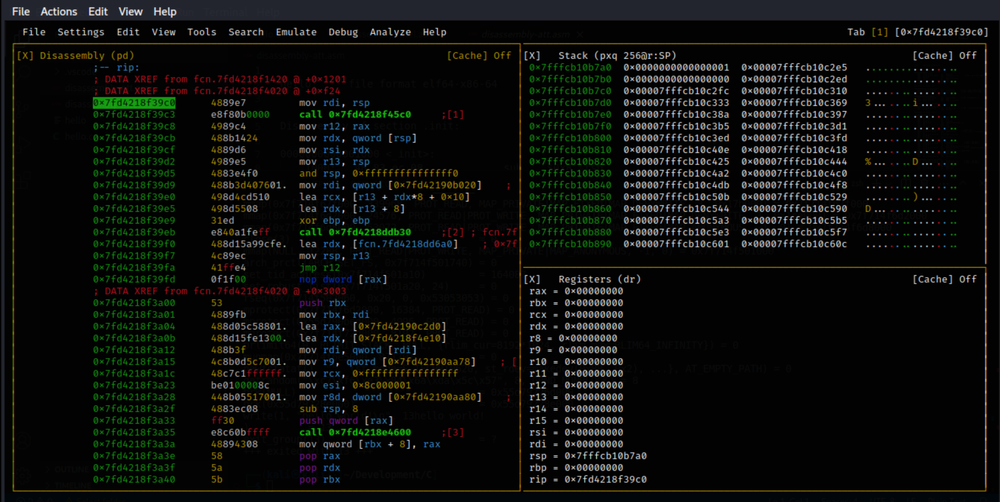
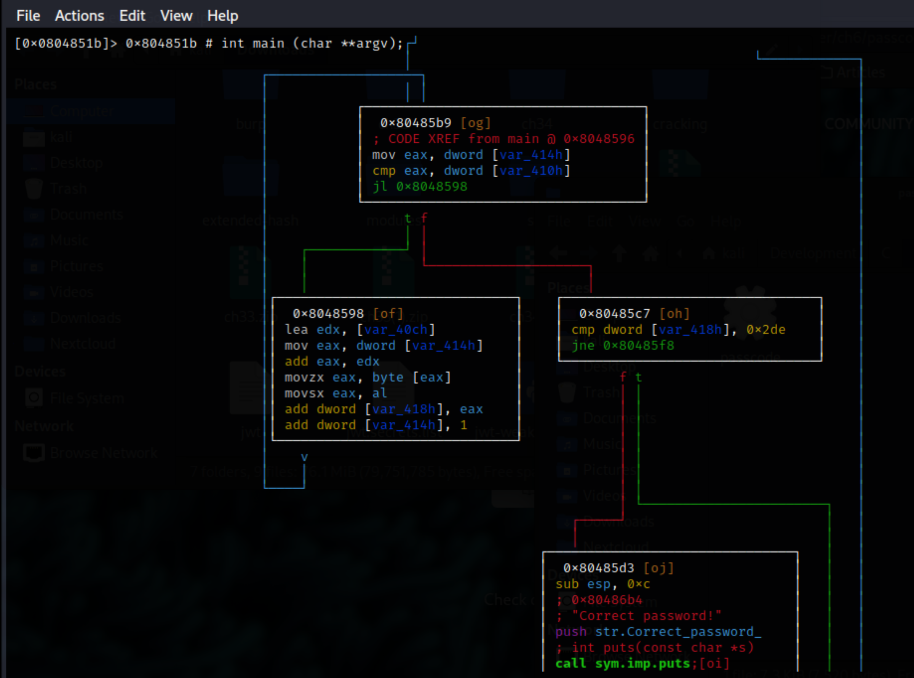
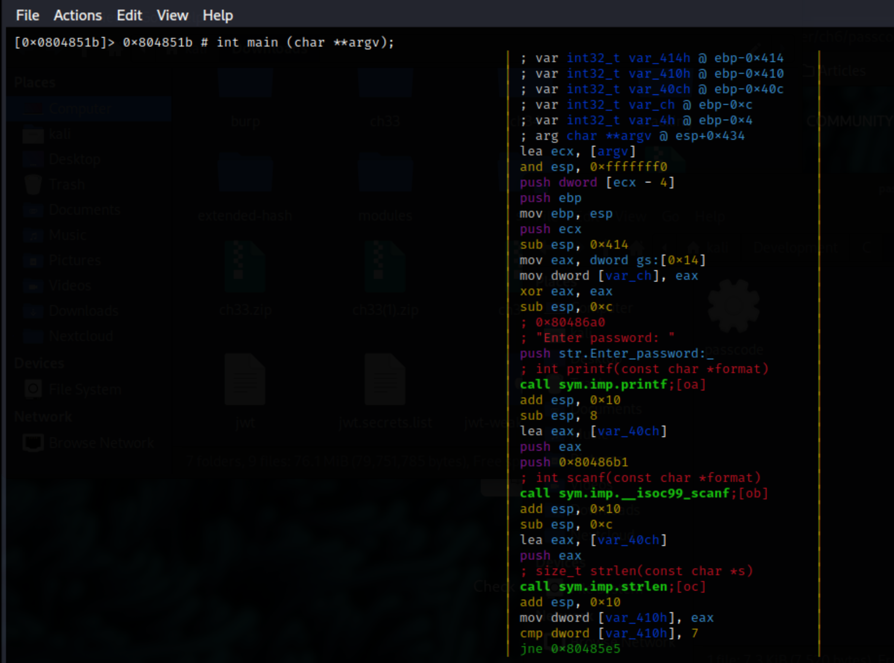
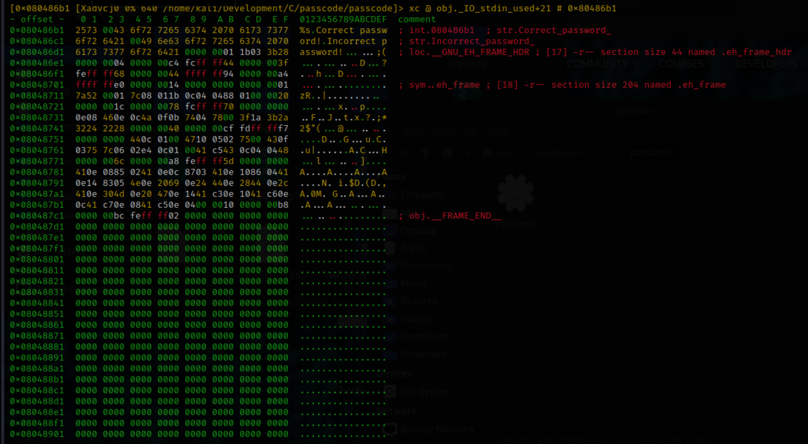

# Reverse engineering in Linux

This is a walkthrough: of:

* Understanding linux executables
* Reversing an ELF file
* Virtualisation in Linux – an analysis of a Windows executable under a Linux host

Install VCodium or VSCode, or another IDE, or just use `vim`. Also, `gcc`.

Create a "hello world!" in C. I named it `hello.c`:

```text
#include <stdio.h>
void main(void)
{
printf ("hello world!\n");
}
```

## Compilation

```text
┌──(kali㉿kali)-[~/Development/C]
└─$ gcc -o hello hello.c
```

The `hello` file is the Linux executable that displays the message "hello world!" in the console.

```text
┌──(kali㉿kali)-[~/Development/C]
└─$ ./hello
hello world!
```                                                                                                                             
## Identification

```text
┌──(kali㉿kali)-[~/Development/C]
└─$ file hello   
hello: ELF 64-bit LSB pie executable, x86-64, version 1 (SYSV), dynamically linked, interpreter /lib64/ld-linux-x86-64.so.2, BuildID[sha1]=8207bd08cd906af9829fcbadd2a0ae7a35b68546, for GNU/Linux 3.2.0, not stripped
```

It uses a 64-bit ELF file-format. Take a look at text strings:

```text
┌──(kali㉿kali)-[~/Development/C]
└─$ strings hello                                   
/lib64/ld-linux-x86-64.so.2
puts
__libc_start_main
__cxa_finalize
libc.so.6
GLIBC_2.2.5
GLIBC_2.34
_ITM_deregisterTMCloneTable
__gmon_start__
_ITM_registerTMCloneTable
PTE1
u+UH
hello world!
;*3$"
GCC: (Debian 12.2.0-9) 12.2.0
Scrt1.o
__abi_tag
crtstuff.c
deregister_tm_clones
__do_global_dtors_aux
completed.0
__do_global_dtors_aux_fini_array_entry
frame_dummy
__frame_dummy_init_array_entry
hello.c
__FRAME_END__
_DYNAMIC
__GNU_EH_FRAME_HDR
_GLOBAL_OFFSET_TABLE_
__libc_start_main@GLIBC_2.34
_ITM_deregisterTMCloneTable
puts@GLIBC_2.2.5
_edata
_fini
__data_start
__gmon_start__
__dso_handle
_IO_stdin_used
_end
__bss_start
main
__TMC_END__
_ITM_registerTMCloneTable
__cxa_finalize@GLIBC_2.2.5
_init
.symtab
.strtab
.shstrtab
.interp
.note.gnu.property
.note.gnu.build-id
.note.ABI-tag
.gnu.hash
.dynsym
.dynstr
.gnu.version
.gnu.version_r
.rela.dyn
.rela.plt
.init
.plt.got
.text
.fini
.rodata
.eh_frame_hdr
.eh_frame
.init_array
.fini_array
.dynamic
.got.plt
.data
.bss
.comment
```

The strings are listed in order from the start of the file. The first part of the list contains the message and the compiler information. The first two lines show what libraries are used.

## objdump

Using the `-d` parameter of the `objdump` command, disassemble the executable code (AT&T syntax):

```text
┌──(kali㉿kali)-[~/Development/C]
└─$ objdump -d hello > disassembly.asm
```

To get Intel syntax, use the `-M intel` parameter:

```text
┌──(kali㉿kali)-[~/Development/C]
└─$ objdump -M intel -d hello > disassembly-intel.asm
```

The disassembly of the code is usually in the `.text` section. Because this is a gcc-compiled program, skip all the initialisation code and look at the main function where the code is.

Moving into dynamic analysis, use `ltrace`, `strace`, and `gdb`.

## ltrace

```text
┌──(kali㉿kali)-[~/Development/C]
└─$ ltrace ./hello
puts("hello world!"hello world!
)                                                         = 13
+++ exited (status 13) +++
```

The output shows a readable code of what the program did. `ltrace` logged library functions that the program called and received. It called `puts` to display a message. And it received an exit status of `13` when the program terminated.

## strace

`strace` logged every system call that happened, starting from when it was being executed by the system. `execve` is the first system call that was logged:

```text
┌──(kali㉿kali)-[~/Development/C]
└─$ strace ./hello
execve("./hello", ["./hello"], 0x7ffd1d6a5f10 /* 65 vars */) = 0
brk(NULL)                               = 0x55d79226d000
mmap(NULL, 8192, PROT_READ|PROT_WRITE, MAP_PRIVATE|MAP_ANONYMOUS, -1, 0) = 0x7f714f6fb000
access("/etc/ld.so.preload", R_OK)      = -1 ENOENT (No such file or directory)
openat(AT_FDCWD, "/etc/ld.so.cache", O_RDONLY|O_CLOEXEC) = 3
newfstatat(3, "", {st_mode=S_IFREG|0644, st_size=87170, ...}, AT_EMPTY_PATH) = 0
mmap(NULL, 87170, PROT_READ, MAP_PRIVATE, 3, 0) = 0x7f714f6e5000
close(3)                                = 0
openat(AT_FDCWD, "/lib/x86_64-linux-gnu/libc.so.6", O_RDONLY|O_CLOEXEC) = 3
read(3, "\177ELF\2\1\1\3\0\0\0\0\0\0\0\0\3\0>\0\1\0\0\0Ps\2\0\0\0\0\0"..., 832) = 832
pread64(3, "\6\0\0\0\4\0\0\0@\0\0\0\0\0\0\0@\0\0\0\0\0\0\0@\0\0\0\0\0\0\0"..., 784, 64) = 784
newfstatat(3, "", {st_mode=S_IFREG|0755, st_size=1922136, ...}, AT_EMPTY_PATH) = 0
pread64(3, "\6\0\0\0\4\0\0\0@\0\0\0\0\0\0\0@\0\0\0\0\0\0\0@\0\0\0\0\0\0\0"..., 784, 64) = 784
mmap(NULL, 1970000, PROT_READ, MAP_PRIVATE|MAP_DENYWRITE, 3, 0) = 0x7f714f504000
mmap(0x7f714f52a000, 1396736, PROT_READ|PROT_EXEC, MAP_PRIVATE|MAP_FIXED|MAP_DENYWRITE, 3, 0x26000) = 0x7f714f52a000
mmap(0x7f714f67f000, 339968, PROT_READ, MAP_PRIVATE|MAP_FIXED|MAP_DENYWRITE, 3, 0x17b000) = 0x7f714f67f000
mmap(0x7f714f6d2000, 24576, PROT_READ|PROT_WRITE, MAP_PRIVATE|MAP_FIXED|MAP_DENYWRITE, 3, 0x1ce000) = 0x7f714f6d2000
mmap(0x7f714f6d8000, 53072, PROT_READ|PROT_WRITE, MAP_PRIVATE|MAP_FIXED|MAP_ANONYMOUS, -1, 0) = 0x7f714f6d8000
close(3)                                = 0
mmap(NULL, 12288, PROT_READ|PROT_WRITE, MAP_PRIVATE|MAP_ANONYMOUS, -1, 0) = 0x7f714f501000
arch_prctl(ARCH_SET_FS, 0x7f714f501740) = 0
set_tid_address(0x7f714f501a10)         = 164087
set_robust_list(0x7f714f501a20, 24)     = 0
rseq(0x7f714f502060, 0x20, 0, 0x53053053) = 0
mprotect(0x7f714f6d2000, 16384, PROT_READ) = 0
mprotect(0x55d790bed000, 4096, PROT_READ) = 0
mprotect(0x7f714f72d000, 8192, PROT_READ) = 0
prlimit64(0, RLIMIT_STACK, NULL, {rlim_cur=8192*1024, rlim_max=RLIM64_INFINITY}) = 0
munmap(0x7f714f6e5000, 87170)           = 0
newfstatat(1, "", {st_mode=S_IFCHR|0620, st_rdev=makedev(0x88, 0x2), ...}, AT_EMPTY_PATH) = 0
getrandom("\xc7\xf6\xe3\x84\x6a\xda\x5c\x57", 8, GRND_NONBLOCK) = 8
brk(NULL)                               = 0x55d79226d000
brk(0x55d79228e000)                     = 0x55d79228e000
write(1, "hello world!\n", 13hello world!
)          = 13
exit_group(13)                          = ?
+++ exited with 13 +++
```

Calling `execve` runs a program pointed to by the filename in its function argument: `open` and `read` are system calls that are used to read files. `mmap`, `mprotect`, and `brk` are responsible for memory activities such as allocation, permissions, and segment boundary setting.

Inside the code of puts, it executes a `write` system call. writing data to the object it was pointed to. `write`'s first parameter has a value of `1`, denoting `STDOUT`. The second parameter is the message.

## gdb

`gdb` can be used to show the disassembly of specified functions with the `disass` command (AT&T syntax):

```text
┌──(kali㉿kali)-[~/Development/C]
└─$ gdb ./hello
GNU gdb (Debian 13.1-2) 13.1
[...]
Reading symbols from ./hello...
(No debugging symbols found in ./hello)
(gdb) disass main
Dump of assembler code for function main:
   0x0000000000001139 <+0>:     push   %rbp
   0x000000000000113a <+1>:     mov    %rsp,%rbp
   0x000000000000113d <+4>:     lea    0xec0(%rip),%rax        # 0x2004
   0x0000000000001144 <+11>:    mov    %rax,%rdi
   0x0000000000001147 <+14>:    call   0x1030 <puts@plt>
   0x000000000000114c <+19>:    nop
   0x000000000000114d <+20>:    pop    %rbp
   0x000000000000114e <+21>:    ret
End of assembler dump.
(gdb) 
```

To set `gdb` to use Intel syntax, use:

    set disassembly-flavor intel

To place a breakpoint at the main function:

```text
(gdb) b *main
Breakpoint 1 at 0x1139
(gdb) run
Starting program: /home/kali/Development/C/hello 
[Thread debugging using libthread_db enabled]
Using host libthread_db library "/lib/x86_64-linux-gnu/libthread_db.so.1".

Breakpoint 1, 0x0000555555555139 in main ()
(gdb) 
```

To get the current values of the registers:

```text
(gdb) info registers
rax            0x555555555139      93824992235833
rbx            0x7fffffffdf38      140737488346936
rcx            0x555555557dd8      93824992247256
rdx            0x7fffffffdf48      140737488346952
rsi            0x7fffffffdf38      140737488346936
rdi            0x1                 1
rbp            0x1                 0x1
rsp            0x7fffffffde28      0x7fffffffde28
r8             0x0                 0
r9             0x7ffff7fcf6a0      140737353938592
r10            0x7ffff7fcb878      140737353922680
r11            0x7ffff7fe18c0      140737354012864
r12            0x0                 0
r13            0x7fffffffdf48      140737488346952
r14            0x555555557dd8      93824992247256
r15            0x7ffff7ffd020      140737354125344
rip            0x555555555139      0x555555555139 <main>
eflags         0x246               [ PF ZF IF ]
cs             0x33                51
ss             0x2b                43
ds             0x0                 0
es             0x0                 0
fs             0x0                 0
gs             0x0                 0
k0             0x40000000          1073741824
k1             0x1400421           20972577
k2             0x0                 0
k3             0x0                 0
k4             0x0                 0
k5             0x0                 0
k6             0x0                 0
k7             0x0                 0
(gdb) 
```

Now being at main, we can run each instruction with step into (the `stepi` (`si`) command and step over (the `nexti` (`ni`) command). Follow this with the `info registers` command to see what values changed.

```text
(gdb) si
0x000055555555513a in main ()
(gdb) disass
Dump of assembler code for function main:
   0x0000555555555139 <+0>:     push   %rbp
=> 0x000055555555513a <+1>:     mov    %rsp,%rbp
   0x000055555555513d <+4>:     lea    0xec0(%rip),%rax        # 0x555555556004
   0x0000555555555144 <+11>:    mov    %rax,%rdi
   0x0000555555555147 <+14>:    call   0x555555555030 <puts@plt>
   0x000055555555514c <+19>:    nop
   0x000055555555514d <+20>:    pop    %rbp
   0x000055555555514e <+21>:    ret
End of assembler dump.
(gdb) 
```

The `=>` indicates where the instruction pointer is located.

```text
(gdb) info registers
rax            0x555555555139      93824992235833
rbx            0x7fffffffdf38      140737488346936
rcx            0x555555557dd8      93824992247256
rdx            0x7fffffffdf48      140737488346952
rsi            0x7fffffffdf38      140737488346936
rdi            0x1                 1
rbp            0x1                 0x1
rsp            0x7fffffffde20      0x7fffffffde20
r8             0x0                 0
r9             0x7ffff7fcf6a0      140737353938592
r10            0x7ffff7fcb878      140737353922680
r11            0x7ffff7fe18c0      140737354012864
r12            0x0                 0
r13            0x7fffffffdf48      140737488346952
r14            0x555555557dd8      93824992247256
r15            0x7ffff7ffd020      140737354125344
rip            0x55555555513a      0x55555555513a <main+1>
eflags         0x246               [ PF ZF IF ]
cs             0x33                51
ss             0x2b                43
ds             0x0                 0
es             0x0                 0
fs             0x0                 0
gs             0x0                 0
k0             0x40000000          1073741824
k1             0x1400421           20972577
k2             0x0                 0
k3             0x0                 0
k4             0x0                 0
k5             0x0                 0
k6             0x0                 0
k7             0x0                 0
(gdb) 
```

## radare2

To get the `filesize`, `timestamp`, and `sha512` hash of the hello world binary file:

```text
┌──(kali㉿kali)-[~/Development/C]
└─$ ls -l hello
-rwxr-xr-x 1 kali kali 15952 Apr 14 06:33 hello
                                                                                                                                                                                                        
┌──(kali㉿kali)-[~/Development/C]
└─$ rahash2 -asha512 hello
hello: 0x00000000-0x00003e4f sha512: 1739c9e1d818fa6f74aaff31373e7ddc4b5fa3d231c0acce02eab96bbce7759300aa7792c015f6d1eb91dcbd535766074eab1575784436a3526b65c980091701                  
```

`rabin2` can extract static information from a file:

```text                                                                                                                                                              
┌──(kali㉿kali)-[~/Development/C]
└─$ rabin2 -I hello
arch     x86
baddr    0x0
binsz    13965
bintype  elf
bits     64
canary   false
class    ELF64
compiler GCC: (Debian 12.2.0-9) 12.2.0
crypto   false
endian   little
havecode true
intrp    /lib64/ld-linux-x86-64.so.2
laddr    0x0
lang     c
linenum  true
lsyms    true
machine  AMD x86-64 architecture
nx       true
os       linux
pic      true
relocs   true
relro    partial
rpath    NONE
sanitize false
static   false
stripped false
subsys   linux
va       true
```

The `bintype`, `class`, `havecode`, and `os` fields indicate that the file is an executable 64-bit ELF file that runs in Linux. `arch`, `bits`, `endian`, and `machine` suggest that the file was built with `x86` code. In addition, the `lang` field indicates that the file was compiled from C.

To list imported functions:

```text
┌──(kali㉿kali)-[~/Development/C]
└─$ rabin2 -i hello
[Imports]
nth vaddr      bind   type   lib name
―――――――――――――――――――――――――――――――――――――
1   0x00000000 GLOBAL FUNC       __libc_start_main
2   0x00000000 WEAK   NOTYPE     _ITM_deregisterTMCloneTable
3   0x00001030 GLOBAL FUNC       puts
4   0x00000000 WEAK   NOTYPE     __gmon_start__
5   0x00000000 WEAK   NOTYPE     _ITM_registerTMCloneTable
6   0x00001040 WEAK   FUNC       __cxa_finalize
```

`__libc_start_main` is a function that initialises the stack frame, sets up the registers and
some data structures, sets up error handling, and then calls the `main()` function.

To get the ELF header info:

```text
┌──(kali㉿kali)-[~/Development/C]
└─$ rabin2 -H hello
0x00000000  ELF64       0x464c457f
0x00000010  Type        0x0003
0x00000012  Machine     0x003e
0x00000014  Version     0x00000001
0x00000018  Entrypoint  0x00001050
0x00000020  PhOff       0x00000040
0x00000028  ShOff       0x00003690
0x00000030  Flags       0x00000000
0x00000034  EhSize      64
0x00000036  PhentSize   56
0x00000038  PhNum       13
0x0000003a  ShentSize   64
0x0000003c  ShNum       31
0x0000003e  ShrStrndx   30
```

If only interested in the strings from the data section:

```text
┌──(kali㉿kali)-[~/Development/C]
└─$ rabin2 -z hello
[Strings]
nth paddr      vaddr      len size section type  string
―――――――――――――――――――――――――――――――――――――――――――――――――――――――
0   0x00002004 0x00002004 12  13   .rodata ascii hello world!
```

Using the radare2 debugger:

```text
──(kali㉿kali)-[~/Development/C]
└─$ r2 -d hello    
[0x7fd4218f39c0]> 
```

`aaa` analyses the code for function calls, flags, references and tries to generate constructive function names:

```text
[0x7fd4218f39c0]> aaaa
[x] Analyze all flags starting with sym. and entry0 (aa)
[x] Analyze function calls (aac)
[x] Analyze len bytes of instructions for references (aar)
[x] Finding and parsing C++ vtables (avrr)
[x] Skipping type matching analysis in debugger mode (aaft)
[x] Propagate noreturn information (aanr)
[x] Finding function preludes
[x] Enable constraint types analysis for variables
```

Visual mode allows easy navigation, has a cursor mode for selecting bytes, and offers numerous key bindings to simplify debugger use. 

The `V` command sets the console to visual mode to debug the program while having an interactive view of the registry and the stack. Entering `:` shows a command console. Pressing `Enter` takes back to visual mode. To exit from visual mode back to command line, press q.



## Getting a password

```text
┌──(kali㉿kali)-[~/Development/C/passcode]
└─$ ls -la         
total 16
drwxr-xr-x 2 kali kali 4096 Apr 15 02:24 .
drwxr-xr-x 4 kali kali 4096 Apr 15 02:24 ..
-rw-r--r-- 1 kali kali 7520 Apr 15 02:23 passcode
```

The tools need access:

```text
┌──(kali㉿kali)-[~/Development/C/passcode]
└─$ chmod +wx passcode
```

### Static

```text
                                                                                                                                                                      
┌──(kali㉿kali)-[~/Development/C/passcode]
└─$ ls -l passcode
-rw-r--r-- 1 kali kali 7520 Apr 15 02:23 passcode
                                                                                                                                                                      
┌──(kali㉿kali)-[~/Development/C/passcode]
└─$ rahash2 -a md5,sha256 passcode
passcode: 0x00000000-0x00001d5f md5: b365e87a6e532d68909fb19494168bed
passcode: 0x00000000-0x00001d5f sha256: 68d6db63b69a7a55948e9d25065350c8e1ace9cd81e55a102bd42cc7fc527d8f
                                                                                                                                                                      
┌──(kali㉿kali)-[~/Development/C/passcode]
└─$ rabin2 -I passcode
arch     x86
baddr    0x8048000
binsz    6280
bintype  elf
bits     32
canary   true
class    ELF32
compiler GCC: (Ubuntu 5.4.0-6ubuntu1~16.04.10) 5.4.0 20160609
crypto   false
endian   little
havecode true
intrp    /lib/ld-linux.so.2
laddr    0x0
lang     c
linenum  true
lsyms    true
machine  Intel 80386
nx       true
os       linux
pic      false
relocs   true
relro    partial
rpath    NONE
sanitize false
static   false
stripped false
subsys   linux
va       true
                                                                                                                                                                      
┌──(kali㉿kali)-[~/Development/C/passcode]
└─$ rabin2 -i passcode
[Imports]
nth vaddr      bind   type   lib name
―――――――――――――――――――――――――――――――――――――
1   0x080483b0 GLOBAL FUNC       printf
2   0x080483c0 GLOBAL FUNC       __stack_chk_fail
3   0x080483d0 GLOBAL FUNC       puts
4   0x00000410 WEAK   NOTYPE     __gmon_start__
5   0x080483e0 GLOBAL FUNC       strlen
6   0x080483f0 GLOBAL FUNC       __libc_start_main
7   0x08048400 GLOBAL FUNC       __isoc99_scanf

                                                                                                                                                                      
┌──(kali㉿kali)-[~/Development/C/passcode]
└─$ rabin2 -H passcode
0x00000000  ELF MAGIC   0x464c457f
0x00000010  Type        0x0002
0x00000012  Machine     0x0003
0x00000014  Version     0x00000001
0x00000018  Entrypoint  0x08048420
0x0000001c  PhOff       0x00000034
0x00000020  ShOff       0x00001888
0x00000024  Flags       0x00000000
0x00000028  EhSize      52
0x0000002a  PhentSize   32
0x0000002c  PhNum       9
0x0000002e  ShentSize   40
0x00000030  ShNum       31
0x00000032  ShrStrndx   28
                                                                                                                                                                      
┌──(kali㉿kali)-[~/Development/C/passcode]
└─$ rabin2 -z passcode
[Strings]
nth paddr      vaddr      len size section type  string
―――――――――――――――――――――――――――――――――――――――――――――――――――――――
0   0x000006a0 0x080486a0 16  17   .rodata ascii Enter password: 
1   0x000006b4 0x080486b4 17  18   .rodata ascii Correct password!
2   0x000006c6 0x080486c6 19  20   .rodata ascii Incorrect password!
```

## Dynamic

```text
                                                                                                                                                                      
┌──(kali㉿kali)-[~/Development/C/passcode]
└─$ ls -l passcode
-rw-r--r-- 1 kali kali 7520 Apr 15 02:23 passcode
                                                                                                                                                                      
┌──(kali㉿kali)-[~/Development/C/passcode]
└─$ rahash2 -a md5,sha256 passcode
passcode: 0x00000000-0x00001d5f md5: b365e87a6e532d68909fb19494168bed
passcode: 0x00000000-0x00001d5f sha256: 68d6db63b69a7a55948e9d25065350c8e1ace9cd81e55a102bd42cc7fc527d8f
                                                                                                                                                                      
┌──(kali㉿kali)-[~/Development/C/passcode]
└─$ rabin2 -I passcode
arch     x86
baddr    0x8048000
binsz    6280
bintype  elf
bits     32
canary   true
class    ELF32
compiler GCC: (Ubuntu 5.4.0-6ubuntu1~16.04.10) 5.4.0 20160609
crypto   false
endian   little
havecode true
intrp    /lib/ld-linux.so.2
laddr    0x0
lang     c
linenum  true
lsyms    true
machine  Intel 80386
nx       true
os       linux
pic      false
relocs   true
relro    partial
rpath    NONE
sanitize false
static   false
stripped false
subsys   linux
va       true
                                                                                                                                                                      
┌──(kali㉿kali)-[~/Development/C/passcode]
└─$ rabin2 -i passcode
[Imports]
nth vaddr      bind   type   lib name
―――――――――――――――――――――――――――――――――――――
1   0x080483b0 GLOBAL FUNC       printf
2   0x080483c0 GLOBAL FUNC       __stack_chk_fail
3   0x080483d0 GLOBAL FUNC       puts
4   0x00000410 WEAK   NOTYPE     __gmon_start__
5   0x080483e0 GLOBAL FUNC       strlen
6   0x080483f0 GLOBAL FUNC       __libc_start_main
7   0x08048400 GLOBAL FUNC       __isoc99_scanf

                                                                                                                                                                      
┌──(kali㉿kali)-[~/Development/C/passcode]
└─$ rabin2 -H passcode
0x00000000  ELF MAGIC   0x464c457f
0x00000010  Type        0x0002
0x00000012  Machine     0x0003
0x00000014  Version     0x00000001
0x00000018  Entrypoint  0x08048420
0x0000001c  PhOff       0x00000034
0x00000020  ShOff       0x00001888
0x00000024  Flags       0x00000000
0x00000028  EhSize      52
0x0000002a  PhentSize   32
0x0000002c  PhNum       9
0x0000002e  ShentSize   40
0x00000030  ShNum       31
0x00000032  ShrStrndx   28
                                                                                                                                                                      
┌──(kali㉿kali)-[~/Development/C/passcode]
└─$ rabin2 -z passcode
[Strings]
nth paddr      vaddr      len size section type  string
―――――――――――――――――――――――――――――――――――――――――――――――――――――――
0   0x000006a0 0x080486a0 16  17   .rodata ascii Enter password: 
1   0x000006b4 0x080486b4 17  18   .rodata ascii Correct password!
2   0x000006c6 0x080486c6 19  20   .rodata ascii Incorrect password!
```

Moving to radare2:

```text
$ radare2 -d passcode
glibc.fc_offset = 0x00148
[0xf7eed450]> aaaa
[x] Analyze all flags starting with sym. and entry0 (aa)
[x] Analyze function calls (aac)
[x] Analyze len bytes of instructions for references (aar)
[x] Finding and parsing C++ vtables (avrr)
[x] Skipping type matching analysis in debugger mode (aaft)
[x] Propagate noreturn information (aanr)
[x] Finding function preludes
[x] Enable constraint types analysis for variables
[0xf7eed450]> s sym.main
[0x0804851b]> VVV
[0x0804851b]>  # int main (char **argv); 
```

This opens up a graphical representation of the disassembly code blocks from the `main` function.
Scroll down , and ha!, the `Correct password!` text string:



In the `0x80485d3` block, where the `Correct password!` string is, the message was displayed using `puts`. Going to that block is a red line from the `0x80485c7` block, in which the value in `local_418h` was compared to `0x2de` (or `734` in decimal format). If equal to `734`, the flow goes to the `Correct password!` block.

There is a loop (blue lines), and to exit the loop, the value at `local_414h` must be greater than or equal to the value at `local_410h`. The loop exits to the `0x80485c7` block. 

At the `0x8048582` block, both values, at `local_418h` and `local_414h` are initialised to 0. These values are compared in the `0x80485b9` block.

In the `0x8048598` block, there are three variables of concern: `local_40ch`, `local_414h`, and `local_418h`. `local_414h` seems to be a pointer of the data pointed to by `local_40c`. `local_418` starts from `0`, and each byte from `local_40ch` is added.

Now looking at the main block:



There are three named functions: `printf()`, `scanf()`, and `strlen()`, and `local_40ch` is the second parameter for `scanf`, while the data at the `0x80486b1` address should contain the format
expected.

To retrieve the data at `0x80486b1`, enter a colon (`:`), enter `s 0x80486b1`, then return back to the visual mode. Press `q` again to view the data:



The code likely looks something like this:

```text
    ...
    printf ("Enter password: ");
    scanf ("%s", local_40ch);
    local_410h = strlen(local_40ch);
    if (local_410h != 7)
        puts ("Incorrect password!);
    else
    {
        int local_418h = 0;
        for (int local_414h = 0; local_414h < local_410h; local_414++)
        {
            local_418h += local_40ch[local_414h];
        }
        if (local_418h == 734)
            puts("Correct password!)
    }
```

The entered password should have a size of `7` characters and the sum of all characters in the password should be equal to `734`. The password can be anything, as long as it satisfies these conditions.

```text
┌──(kali㉿kali)-[~/Development/C/passcode]
└─$ ltrace ./passcode 
__libc_start_main(0x804851b, 1, 0xffab2254, 0x8048620 <unfinished ...>
printf("Enter password: ")                                                                            = 16
__isoc99_scanf(0x80486b1, 0xffab1d7c, 0xf7f3cbac, 1Enter password: hiiiiii
)                                                  = 1
strlen("hiiiiii")                                                                                     = 7
puts("Correct password!"Correct password!
)                                                                             = 18
+++ exited (status 0) +++
```
