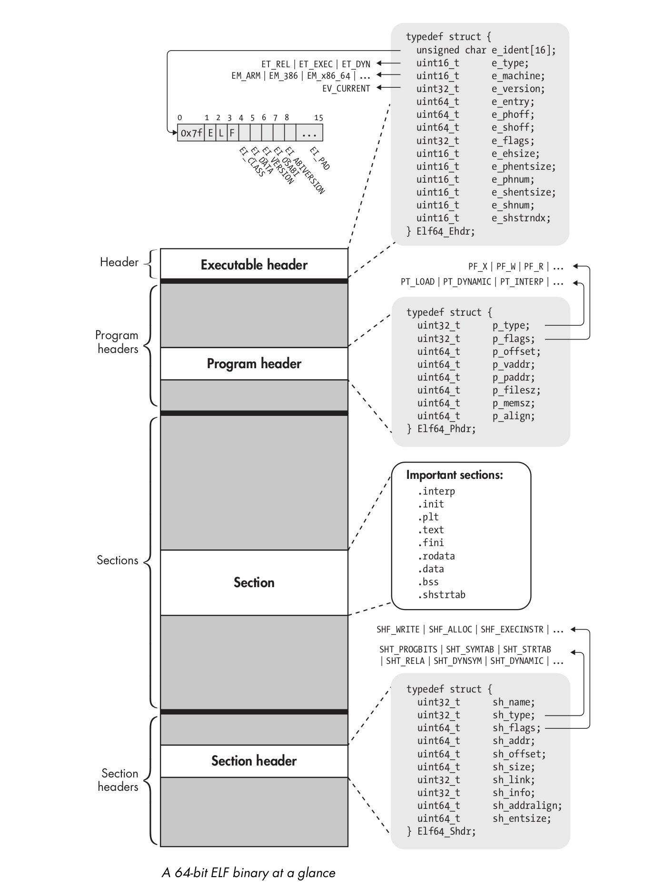

# Executable file formats

## ELF

Executable and Linkable Format (ELF) is the default binary format on Linux-based systems. It is used for executable files, object files, shared libraries, and core dumps.

Every ELF file starts with an executable header, which is just a structured series of bytes telling you that it’s an ELF file, what kind of ELF file it is, and where in the file to find all the other contents.

## PE

## RootMe challenges

* [ELF x86 - 0](../formats/elf-x86-0.md)
* [ELF x86 - Basic](../formats/elf-x86-basic.md)
* [PE x86 - 0](../formats/pe-x86-0.md)
* [ELF C++ - 0](../formats/elf-cpp-0.md)
* [PE DotNet - 0](../formats/pe-dotnet-0.md)