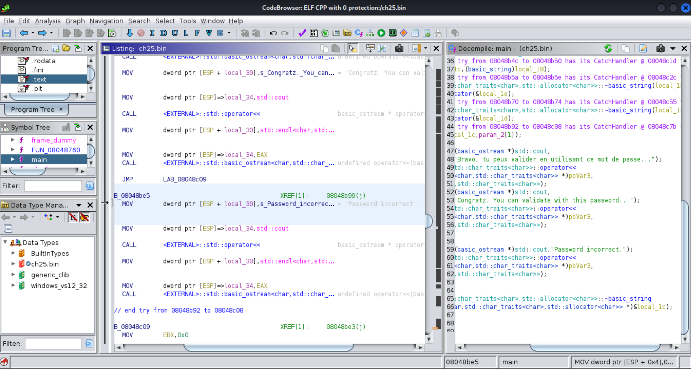
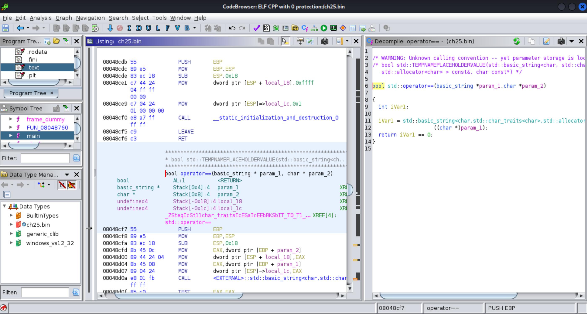
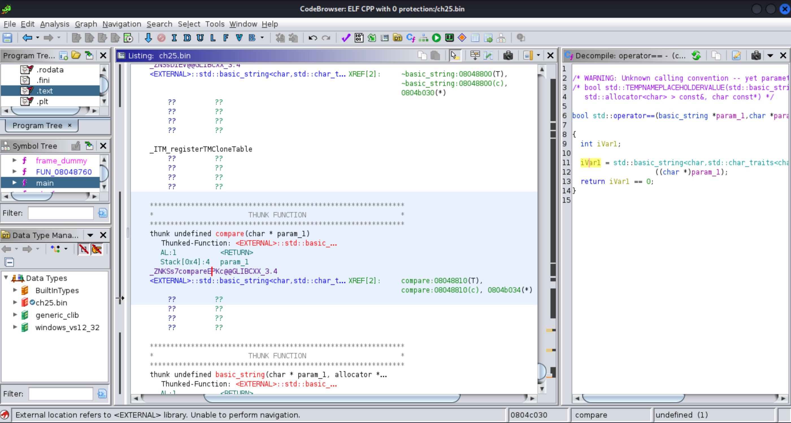
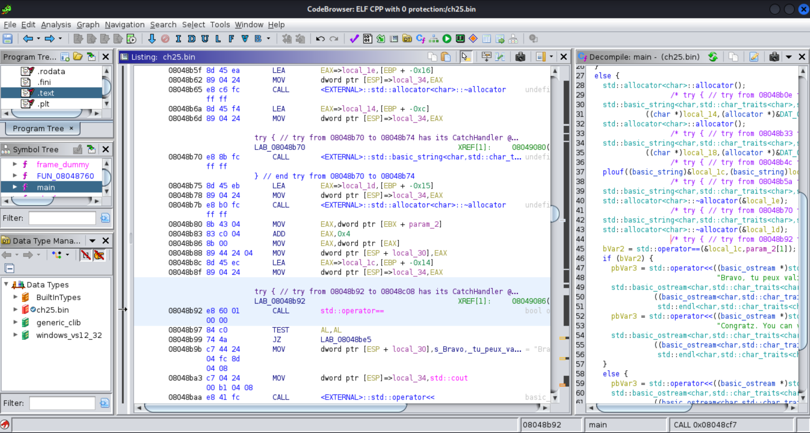

# ELF C++ - 0 protection

[RootMe challenge: ELF C++ - 0 protection](https://www.root-me.org/en/Challenges/Cracking/ELF-C-0-protection): std::string

Find the validation password.

----

Make the file executable:

```text
┌──(kali㉿kali)-[~/Downloads/cracking/ch25]
└─$ chmod +x ch25.bin 
```

Check it runs in gdb:

```text
┌──(kali㉿kali)-[~/Downloads/cracking/ch25]
└─$ gdb ./ch25.bin   
GNU gdb (Debian 13.1-2) 13.1
Copyright (C) 2023 Free Software Foundation, Inc.
License GPLv3+: GNU GPL version 3 or later <http://gnu.org/licenses/gpl.html>
This is free software: you are free to change and redistribute it.
There is NO WARRANTY, to the extent permitted by law.
Type "show copying" and "show warranty" for details.
This GDB was configured as "x86_64-linux-gnu".
Type "show configuration" for configuration details.
For bug reporting instructions, please see:
<https://www.gnu.org/software/gdb/bugs/>.
Find the GDB manual and other documentation resources online at:
    <http://www.gnu.org/software/gdb/documentation/>.

For help, type "help".
Type "apropos word" to search for commands related to "word"...
Reading symbols from ./ch25.bin...
(No debugging symbols found in ./ch25.bin)
(gdb) run 123
Starting program: /home/kali/Downloads/cracking/ch25/ch25.bin 123
[Thread debugging using libthread_db enabled]
Using host libthread_db library "/lib/x86_64-linux-gnu/libthread_db.so.1".
Password incorrect.
[Inferior 1 (process 31179) exited normally]
```

Start up Ghidra and find the phrase "Password incorrect.":



Brings this function:



Which uses this function comparing two passed parameters, an input string, and a string of the program. We just need to find out what string is passed to this function to solve this problem.



The address from where the function is called (`0x08048B92`):



In gdb, set a breakpoint at the address where the function is called (`0x08048B92`) and look at the registers. The password will be pointed to by `ESP -> EAX -> MEM`.

## Resources

* [Reversing C++ - Blackhat - Yason Sabanal - paper](https://repository.root-me.org/Reverse%20Engineering/EN%20-%20Reversing%20C++%20-%20Blackhat%20-%20Yason%20Sabanal%20-%20paper.pdf)
* [Reversing C++ - Blackhat - Yason Sabanal - slides](https://repository.root-me.org/Reverse%20Engineering/EN%20-%20Reversing%20C++%20-%20Blackhat%20-%20Yason%20Sabanal%20-%20slides.pdf)
