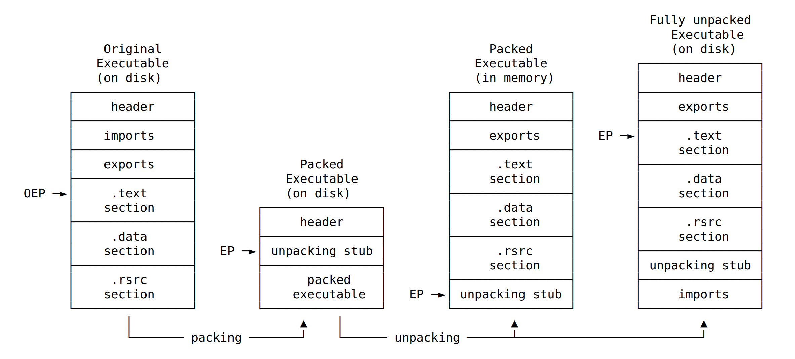

| 
|:--:|
| [THM Room: REMnux](https://tryhackme.com/room/malremnuxv2) |

# I hope you packed your bags

File entropy is very indicative of the suspiciousness of a file and is a prominent characteristic that the tools 
look for within a Portable Executable (PE).

At it’s very simplest, file entropy is a rating that scores how random the data within a PE file is. With a scale of 
0 to 8. 0 meaning the less "randomness" of the data in the file, where a scoring towards 8 indicates this data is 
more "random".

For example, files that are encrypted will have a very high entropy score. Where files that have large chunks of the 
same data such as `1`s will have a low entropy score.

Malware authors use techniques such as encryption or packing to obfuscate their code and to attempt to bypass 
antivirus. Because of this, these files will have high entropy. If an analyst had 1,000 files, they could rank the 
files by their entropy scoring, and the files with the higher entropy should be analysed first.

## Packing/unpacking

| 
|:--:|
| The unpacking stub unpacks the original executable into memory, resolves imports, and   transfers execution to the OEP |

* Executables have what's called an entry point. When launched, this entry point is simply the location of the first 
pieces of code to be executed within the file.
* When an executable is packed, it must unpack itself before any code can execute. Because of this, packers change 
the entry point from the original location to what's called the "Unpacking Stub".
* The "Unpacking Stub" will begin to unpack the executable into its original state. Once the program is fully 
unpacked, the entry point will now relocate back to its normal place to begin executing code.
* It is only at this point can an analyst begin to understand what the executable is doing as it is now in its true, 
original form.

## Identifying packers

* Opening a packed executable with tools like OllyDbg and IDA-Pro will produce a warning that the executable may be 
packed.
* Packed programs have very few imports (usually `LoadLibrary` and `GetProcAddress`), or no import at all.
* Many packers leave text signatures inside the packed binary.
* In some cases, the `file` command will be able to identify the packer (`UPX compressed`, `PECompact2 compressed`)
* Tools like [PEiD](https://github.com/wolfram77web/app-peid) ([python version](https://github.com/packing-box/peid)) 
and [pev](https://www.kali.org/tools/pev/) detect most common packers, cryptors and compilers for PE files.

## Questions

**What is the highest file entropy a file can have?**

Answer: `8`

**What is the lowest file entropy a file can have?**

Answer: `0`

**Name a common packer that can be used for applications?**

Answer: `UPX`

