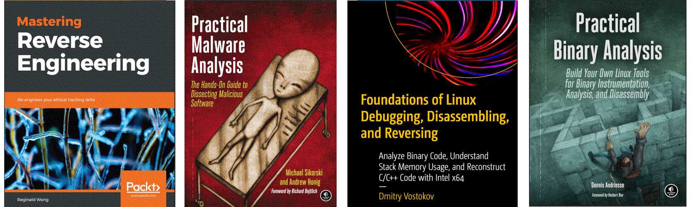

Cracking nuts
=========================================

Deciphering the inner workings of compiled languages in detail. Disassembling binaries to solve the crackmes at the assembly level.

.. image:: _static/images/in-progress.png
  :alt: Forever in progress ...

----

.. toctree::
   :maxdepth: 1
   :includehidden:
   :caption: Preparation

   Testlab: Assemblers and compilers <https://red.tymyrddin.dev/projects/testlab/en/latest/docs/dev/README.html>
   Testlab: Disssemblers and decompilers <https://red.tymyrddin.dev/projects/testlab/en/latest/docs/dis/README.html>

.. toctree::
   :glob:
   :maxdepth: 1
   :includehidden:
   :caption: Notes on techniques

   docs/notes/README.md
   docs/notes/formats.md

.. toctree::
   :glob:
   :maxdepth: 1
   :includehidden:
   :caption: File formats

   docs/formats/README.md
   docs/formats/elf-x86-0.md
   docs/formats/elf-x86-basic.md
   docs/formats/pe-x86-0.md
   docs/formats/elf-cpp-0.md
   docs/formats/pe-dotnet-0.md

----

